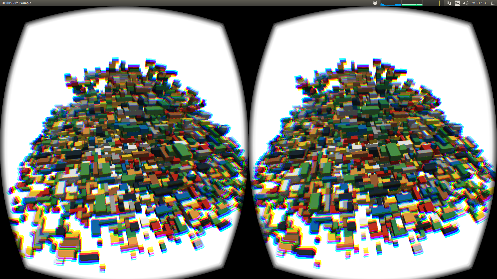

## NimOculusRiftExample

This is a simple Oculus Rift example written in Nim, using my [bindings of the OVR library](https://github.com/bluenote10/nim-ovr). In order to run you have to install the following dependencies in nimble:

    nimble install opengl
    nimble install nim-glfw
    nimble install nim-ovr

The example was only tested under Linux using libOVR 0.5.0.1, but it should be straightforward to run on other systems.
The demo scene simply generates a random heap of LEGO-like bricks (official LEGO dimensions and colors, but no knobs):

The graphics engine uses modern but simple OpenGL techniques, i.e., VAO + VBO + a Gaussian lighting shader.

